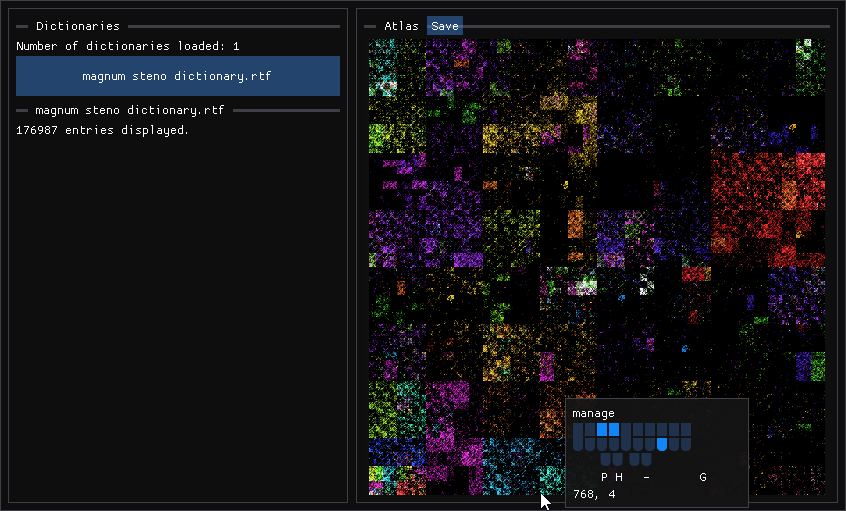

# [Steno Atlas](http://zstolfi.github.io/steno/atlas)
Browse single-stroke dictionary entries via [Hibert curve](https://en.wikipedia.org/wiki/Hilbert_curve).

* * *

# [Atlas Source Code](https://github.com/zstolfi/steno/tree/main/atlas/src#steno-atlas)
Written in C++. Uses a work in progress API for computing with steno strokes/briefs.
